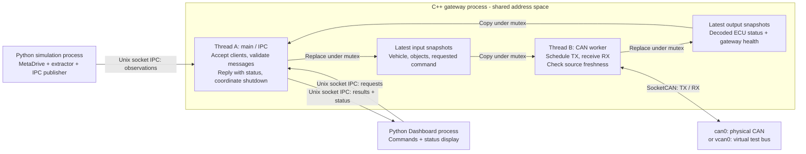

# Data Flow

The target runtime has three Linux application processes. Socket IPC carries observations, requests, and reported status between them. Only the C++ gateway opens SocketCAN for production AFS traffic. The repository now has separate `simulation_runner/`, `bridge/`, and `dashboard/` component trees, but the IPC and gateway runtime behavior described below is not implemented. See [overview.md](overview.md) for the whole-system flowchart.

## Inside The Gateway



Thread A handles the local Python clients. Thread B owns CAN transmission and reception. Both use short locks to exchange whole snapshots inside the C++ process. The Python processes never share the C++ state object.

A single event loop could handle the initial traffic; the proposed two-thread split isolates IPC parsing and Dashboard activity from scheduled CAN work. It is not a hard real-time guarantee. Use `poll()` and monotonic deadlines for the CAN worker; a separate RX thread or condition variable is not required by this design.

## Python Simulation Loop

```text
MetaDrive reset/step
  -> take one monotonic timestamp
  -> extract EgoSnapshot and SurroundingSnapshot
  -> construct matching immutable SceneSnapshot
  -> replace the latest in-process scene under a short lock
  -> invoke the preserved ego-only callback
  -> optional scene_display reads the latest scene from its HTTP thread
  -> later: project and publish through the adapter's IPC client
  -> continue the simulation loop
```

The extraction and scene-store operations are implemented calls within one Python application process. `get_scene_snapshot()` returns the complete current ego and surrounding sample; component getters are available for consumers that need only one part. The store retains only the newest scene, so slow readers do not create a backlog. The optional `scene_display` reads that interface and serves normalized JSON to a local browser at 10 Hz without blocking simulation ingestion. It is a development observer and is separate from the planned production Dashboard. Unix-socket publication remains planned. MetaDrive owns no CAN IDs or payload packing; its lifecycle and driving controls stay in Python.

## Cross-Process Contract

The proposed transport is Unix Domain Sockets, `SOCK_SEQPACKET`, with versioned JSON messages. Simulation and Dashboard use separate client connections to a gateway-owned server. Exact fields and message names remain draft design.

| Message kind | Producer | Consumer | Meaning |
|---|---|---|---|
| Vehicle state | Python adapter | C++ gateway | Steering, speed, validity, sample identity, and simulation metadata |
| Object state | Python adapter | C++ gateway | Ego-relative observed geometry, dimensions, validity, and sample identity |
| Dashboard command | Python Dashboard | C++ gateway | Requested power/mode or an identified clear-fault action |
| Command result | C++ gateway | Python Dashboard | Gateway accepted or rejected a request |
| System status | C++ gateway | Python Dashboard | ECU-reported output/faults, current source state, freshness, and gateway health |

Gateway acceptance is not confirmation of physical execution. The Dashboard must distinguish the operator's request, gateway acceptance, and ECU-reported executed state.

Use complete current snapshots for continuous observations and persistent requests. Use identified, bounded pending actions for momentary commands so they are not silently overwritten. Keep outgoing status bounded and replaceable so a slow Dashboard cannot block CAN.

## CAN Transfer

The existing IDs below remain provisional design values, not new constraints introduced by the refactor.

| CAN ID | Message | Bus producer | Bus consumer |
|---:|---|---|---|
| `0x200` | `Vehicle_Steering` | C++ gateway | AFS ECU |
| `0x300` | `Vehicle_Speed` | C++ gateway | AFS ECU |
| `0x310` | `Vehicle_Object` | C++ gateway | AFS ECU |
| `0x400` | `Dashboard_Command` | C++ gateway | AFS ECU |
| `0x100` | `AFS_Status` | AFS ECU | C++ gateway |

Python converts simulator-specific state into observations. C++ converts observations into the CAN representation, including object-grid compression where the contract requires it. STM32 performs the final swivel/dimming calculations and physical output selection.

The planned DBC defines CAN packing and signal meaning. Generated C pack/unpack functions can serve the C++ gateway and firmware; runtime transport is native SocketCAN. Counter handling, checksums, timeouts, and multi-frame assembly require explicit application behavior alongside the DBC.

## State, Timing, And Failures

- Build and validate complete snapshots before taking the state mutex. Copy or replace under the lock, then release it before encoding, socket I/O, logging, or display.
- Schedule CAN independently from the simulation update interval. Reuse a recent observation only while it satisfies the agreed source-freshness policy.
- Keep source age distinct from CAN alive counters and IPC connection liveness. Receiving or transmitting another copy of an old sample must not make the observation fresh again.
- Track sample/session identity and simulation time separately from host monotonic time. Define restart, reset, pause, backlog, and unpaced-simulation behavior before HIL integration.
- Use bounded buffering; avoid replaying a queue of outdated vehicle states. Define queue-age checks as part of detailed IPC design.
- Missing simulation updates invalidate source data. Dashboard disconnects follow an explicit command-lifetime policy. Missing ECU status makes the displayed status stale.
- STM32 independently validates incoming CAN and handles stale/invalid data even if the gateway crashes.
- Waking and joining the CAN worker, closing sockets, and releasing owned resources belong to coordinated gateway shutdown.

These are proposed behaviors; no IPC or gateway runtime is implemented yet.
