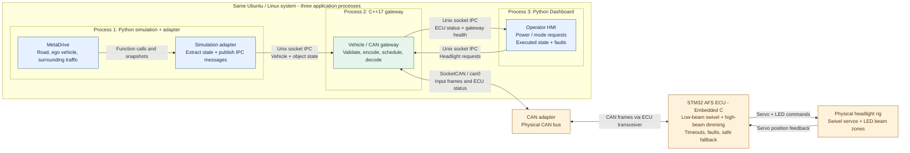

# System Architecture

Simulated driving and operator requests feed a physical STM32 controller, which swivels low-beam headlights and dims high-beam zones around other vehicles. The Dashboard displays the ECU's reported output and faults.

This flowchart shows the target runtime after the component reorganization. The Python runner, controls, and ego extractor are implemented. The IPC adapter, C++ bridge runtime, Dashboard runtime, and firmware remain planned.

## System At A Glance

The forward path is MetaDrive -> Python adapter -> IPC -> C++ gateway -> CAN -> STM32 -> headlights. Operator requests join at the gateway. ECU status returns through CAN and the gateway to the Dashboard; servo feedback goes directly to STM32.

## Processes And Threads

A process is a separately running program with its own memory. Threads are execution paths inside one process and can share that process's memory. These applications are three processes, not three threads.

| Application process | Application work | Communication |
|---|---|---|
| Python simulation + adapter | Run MetaDrive, extract state, publish observations in the simulation loop | Local function calls inside the process; Unix socket IPC to the gateway |
| C++ gateway | Main/IPC thread plus a CAN TX/RX worker thread | Mutex-protected snapshots internally; Unix sockets to Python clients; SocketCAN to the bus |
| Python Dashboard | UI interaction and gateway client | Unix socket IPC to the gateway |

The process numbers identify applications, not startup order or dedicated CPU cores. MetaDrive and UI libraries may use additional internal threads. For a browser-based Dashboard, its Python backend owns the Unix socket; the browser communicates with that backend.

See [data-flow.md](data-flow.md) for the gateway thread diagram and the distinction between socket IPC and in-process state.

## Ownership

| Component | Owns |
|---|---|
| [MetaDrive and Python adapter](components/metadrive.md) | Simulation lifecycle, driving controls, extraction, simulator coordinate conversion, and observation publishing |
| [C++ gateway](components/bridge.md) | IPC, current source state, CAN conversion/scheduling/TX/RX, decoded ECU status, and communication diagnostics |
| [Dashboard](components/dashboard.md) | Operator requests and display of reported state |
| [STM32 ECU](components/afs-ecu.md) | Final AFS/ADB decisions, actuator commands, feedback supervision, and independent fault/timeout handling |
| [Headlight rig](components/headlights.md) | Physical low-beam swivel and segmented high-beam output |

## Current Implementation And Design Status

- The Python implementation is under `simulation_runner/`. Its runner emits `EgoSnapshot` through a callback that will connect to `ipc_adapter/`.
- `bridge/` now contains the C++17/CMake gateway module scaffold; no executable, IPC, or CAN behavior exists yet.
- `dashboard/` now contains the Python package scaffold; no UI or gateway-client behavior exists yet.
- Surrounding extraction, DBC, and STM32 firmware are not implemented.
- The proposed baseline is C++17/CMake and Unix Domain Sockets with `SOCK_SEQPACKET` carrying versioned JSON. Message fields, timing, and recovery policies remain detailed-design work.
- The established component layout and future deeper structure are documented in [desired_file_system.md](../temporary/desired_file_system.md).

## Virtual Tests And Physical HIL

Use `vcan0` for gateway integration tests with CAN inspection tools or a software ECU. It is a virtual bus and has no physical STM32 connection. A full SIL control test also needs software ECU logic; virtual CAN alone does not exercise AFS control.

The flowchart above shows physical HIL through `can0`, a CAN adapter, the bus, and the ECU transceiver. The STM32F407VE owns the CAN controller; transceiver selection, logic levels, termination, and wiring remain hardware bring-up work.
